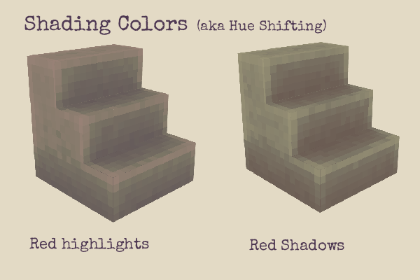
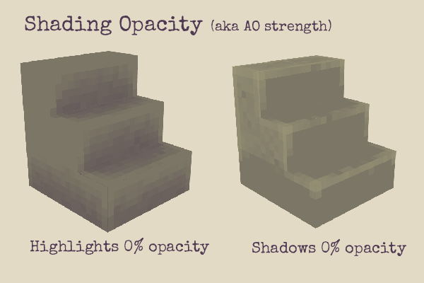
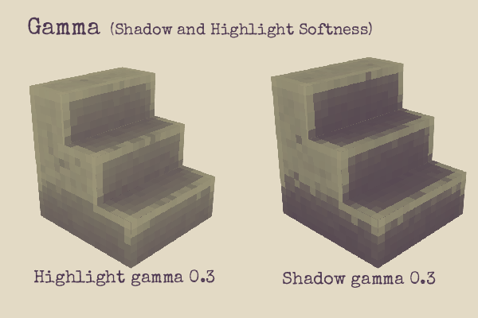
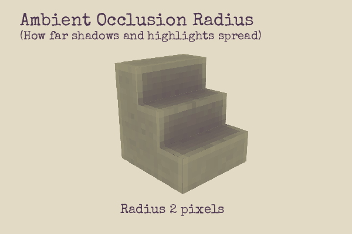
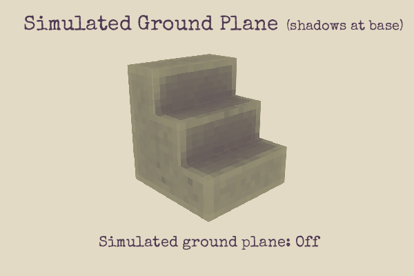
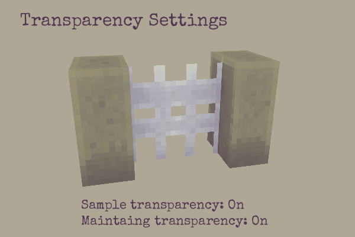

# Mr Salmon's Baked Ambient Occlusion

Generate instant shaded textures for your models with one click! This plugin bakes ambient occlusion directly onto your mesh textures by calculating how much ambient light can reach each pixel on the model. Ambient, in this context, means "equally from-all directions". Areas in crevices and divots receive less light than those at the edges, creating natural depth and shading effects. Pixels on the sharp edge of models recieve more light, so are highlighted.

To use this plugin, select a mesh and go to `Tools > Bake Ambient Occlusion`. Configure your settings in the dialog and click `Confirm` to start the baking process.

## How Ambient Occlusion Works

Ambient occlusion works by casting rays from each pixel on your model's surface to determine how much ambient light can reach that point. Areas that are occluded by nearby geometry (like crevices, corners, and recessed areas) receive less light and appear darker, while exposed edges and surfaces remain bright. By exaggerating this effect, you can even simulate how dirt accumulates in crevices and how edges of hard materials like rocks, wood, and metal get worn and lightened over time.

## Settings Reference

### Colors and Opacity

**Highlight Color & Opacity**: Sets the color and transparency used for well-lit, exposed areas of your model. These areas typically represent worn edges or surfaces that receive full ambient lighting.

**Shadow Color & Opacity**: Sets the color and transparency used for occluded, shadowed areas. These areas represent crevices, corners, and recessed surfaces where dirt and grime would naturally accumulate.

### Gamma Correction

**Highlight Gamma**: Controls the contrast and falloff of highlight areas. Lower values create more dramatic contrast with sharper transitions, while higher values create softer, more gradual highlights.

**Shadow Gamma**: Controls the contrast and falloff of shadow areas. Higher values create softer, more subtle shadows, while lower values create harder, more defined shadows.

### AO Strength and Quality

**Samples per pixel**: Determines the quality and accuracy of the ambient occlusion calculation. Higher values produce smoother, more accurate results but take longer to process. Recommended values:
- 100-500 samples for quick previews, or when using uniform sampling.
- 1000+ samples for final quality results

**Sample Method**: Choose between sampling methods:
- **Random**: Slightly more accurate but can be noisier, especially with fewer samples. Of course, noise can be desirable!
- **Uniform**: Produces smoother results with fewer samples but may show artifacts in some cases, especailly with low samples.

### Occlusion Radius

**Ambient Occlusion Radius (Pixels)**: Controls how far the occlusion effect extends from each surface. Larger values create larger shadows that affect more distant geometry, while smaller values create tighter, more localized effects. Use larger values for bigger models or higher-resolution textures.

### Ground Plane Simulation

**Simulate Ground Plane**: Allows the ground beneath your model to occlude light. This creates natural contact shadows at the base of your model, making it appear more grounded. 

### Transparency Handling

**Retain Texture Transparency**: Preserves the original alpha channel of your textures. When enabled, the ambient occlusion effect will respect existing transparent areas and not overwrite them completely.

**Sample Texture Transparency**: Makes the occlusion calculation consider the transparency of textures when casting rays. Semi-transparent areas will allow some light to pass through rather than casting complete shadows. This produces more accurate results in models with a lot of transparent pixels but increases processing time significantly.

## Usage Tips

### Getting Started
1. Select the mesh you want to process (only one mesh at a time is supported)
2. Go to `Tools > Bake Ambient Occlusion`
3. Adjust settings based on your model size and desired effect
4. Click `Confirm` to start baking

### Recommended Settings
- **For quick previews**: 100-200 samples, uniform sampling
- **For final results**: 1000+ samples, random sampling
- **For large models**: Increase ambient occlusion radius to 12-16
- **For detailed textures**: Use higher sample counts and enable texture transparency sampling

# Credit and Acknowledgments

Plugin by Kai Salmon. 

Massive performance gains were achieved by using [ThreeJS Bounding Volume Heiarachies 
](https://github.com/gkjohnson/three-mesh-bvh) by  Garrett Johnson. 

# Source code and Contributions

You can contribute to the code and report any issues on [github](https://github.com/kaisalmon/MrsSalmonsBlockbenchBakedAmbientOcclusion/blob/main/about.md).