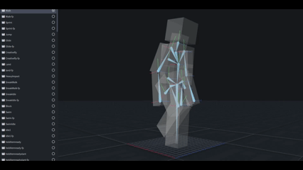

# Bone View Plugin for Blockbench

The Bone View plugin provides an essential toolset for animators and riggers working in Blockbench. It adds a toggleable "Bone View" mode that visualizes your model's armature, making it easier to understand and debug complex rigs.

## Features

-   **Clear Armature Visualization**: Toggling Bone View makes your model's geometry semi-transparent and displays the underlying bone structure.
-   **Bone and Pivot Representation**: Each group is represented by a bone and an axis helper, clearly marking its pivot point and orientation.
-   **Customizable Hotkey**: Quickly toggle the view with a hotkey (default: `Shift+B`), which can be customized in the settings.
-   **Seamless Integration**: The plugin adds a "Toggle Bone View" button to the "View" menu for easy access.

## Usage

1.  **Toggling the View**: 
    * Go to the "View" menu and click "Toggle Bone View".
    * Use the hotkey `Shift+B` to toggle the view instantly.
2.  **Customization**:
    * To change the hotkey, go to `File > Settings > Keybindings` and modify the "Bone View Hotkey" field.

---

## Acknowledgements

This plugin was developed to enhance the asset creation workflow for the game **[Vintage Story](https://www.vintagestory.at/)**.

The plugin's icon is provided by [game-icons.net](https://game-icons.net/) under the CC BY 3.0 license.
