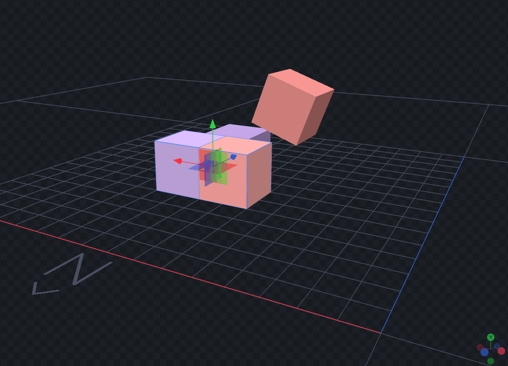

# Enhanced Translation Plane Gizmo v2.0

## Features:
- **2D Plane Movement**: Drag colored planes to move objects along two axes simultaneously
- **Gradient Color System**: Each plane displays a gradient between the two axes it controls (XY: Green→Red, XZ: Red→Blue, YZ: Green→Blue)
- **Smart Integration**: Seamlessly works with Blockbench's transform system
- **Grid Snapping**: Automatic grid alignment when enabled
- **Undo Support**: Full integration with Blockbench's undo system
- **Performance Optimized**: Minimal overhead and efficient event handling
- **Toggle Control**: Toolbar button to easily enable/disable the gizmo

## How it works:
- **XY Plane (Green→Red gradient)**: Move objects in X and Y directions simultaneously
- **XZ Plane (Red→Blue gradient)**: Move objects in X and Z directions simultaneously
- **YZ Plane (Green→Blue gradient)**: Move objects in Y and Z directions simultaneously

## Usage:
1. Select objects in the 3D view
2. Switch to **Move tool**
3. You'll see three gradient-colored planes around the selection
4. Click and drag any plane to move the object in that 2D plane
5. Hold Shift for grid snapping (if enabled)

## Integration:
- Works with cubes, meshes, and groups
- Respects Blockbench's transform space settings
- Compatible with proportional editing
- Supports both local and global transform spaces

## Technical Details:
- Uses ThreeJS for 3D rendering with custom gradient shader materials
- Integrates with Blockbench's transformer system
- Supports undo/redo operations
- Optimized for performance with minimal updates
- Compatible with Blockbench 4.0.0+

## Demo

*Drag the gradient planes to move objects along two axes simultaneously*

*Use the toolbar button to toggle the gizmo on/off*

## Debug Features:
- Console logging for troubleshooting
- Debug overlay for development
- Comprehensive raycast testing
- Scene integration verification
