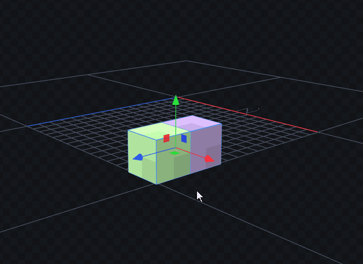

# Translation Plane Gizmo v1.0.0

## Features:
- **2D Plane Movement**: Drag colored planes to move objects along two axes simultaneously
- **RGB Color Coding**: XY (Blue), XZ (Green), YZ (Red) planes for easy identification
- **Smart Integration**: Seamlessly works with Blockbench's transform system
- **Blender-Style Handles**: Small, finite square handles like professional 3D software
- **Smart Camera Scaling**: Handles scale with zoom level like built-in arrow gizmos
- **Toggle Button**: Dedicated toolbar button to enable/disable the gizmo (Ctrl+Shift+P)
- **Cross-Version Compatible**: Works with Blockbench v5
- **Undo Support**: All movements are properly integrated with Blockbench's undo system
- **Grid Snapping**: Optional grid snapping for precise positioning
- **Multi-Selection**: Works with multiple selected objects
- **Transform Spaces**: Supports both local and global transform spaces
- **French Language Support**: Full localization for French users

## How it works:
- **XY Plane (Blue)**: Moves objects in X and Y directions simultaneously
- **XZ Plane (Green)**: Moves objects in X and Z directions simultaneously
- **YZ Plane (Red)**: Moves objects in Y and Z directions simultaneously

## Usage:
1. Select objects in the 3D view
2. Switch to the **Move** tool
3. You'll see three colored planes around the selection
4. Click and drag any plane to move the object in that 2D plane
5. Hold Shift to toggle grid snapping (if enabled)
6. Use the toolbar button to toggle the gizmo on/off

## Integration:
- Works with cubes, meshes, and groups
- Respects Blockbench's transform space settings
- Compatible with proportional editing
- Supports local and global transform spaces

## Technical Details:
- Uses ThreeJS for 3D rendering with solid color materials
- Integrates with Blockbench's transformer system
- Supports undo/redo operations
- Optimized for performance with minimal updates
- Compatible with Blockbench 5.0.0+
- Smart event handling for element visibility changes
- Proper cleanup on plugin unload
- Production-ready with no debug logging
